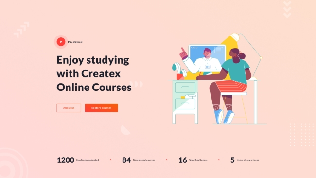
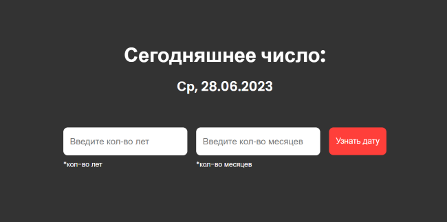
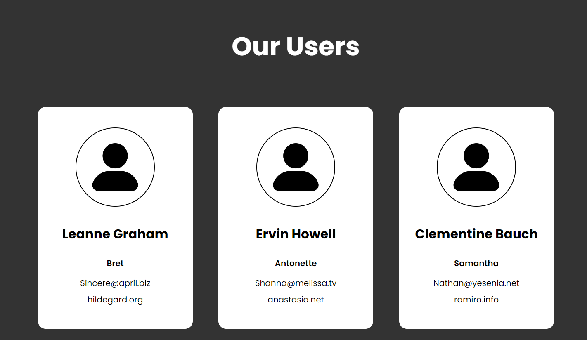

# Aliaksei Lahuta

## Frontend Developer


### `Country of birth`: Belarus;
### `Age`: 18 years old;
### `Date of Birthday`: 19-10-2004;
### `Current country`: Poland


## Contacts:
1. `Gmail`: frontenderboy@gmail.com;
2. `Telegram`: [Aliaksei Lahuta](https://t.me/Lesha_Laguta);
3. `Phone`: +48452651906;
4. `Discord`: aliakseilahuta


## About Me:

Hey there! I'm Alex! I'm a student at a Polish Uniwersity! I really like programming and I feel that it's my life! 
I have a Telegram [Channel](https://t.me/frontendersstudy). In this channel I tell and make posts, how I learn Frontend and tell which technologies I want to learn. So, I really want to invite you in this channel and go on this way together!

Why I learn programming (Frontend) and why I want to become a programmer who work in big company? My answer is very simple - I want it! When I planning what I want to make, what a Website and write a code after, I feel a sense of satisfaction! It's true!


## Skills:

- `HTML5`;
- `CSS3`;
- `JS Basics`;
- `Preprocessor Sass`;
- `Git, GitHub`;
- `Figma`;


## Code Example:

``` JavaScript
function between(a, b) {
  let array = [];
    if(a < b) {
        for(let i = a; i <= b; i++) {
            array.push(i)
        }
    } else {
        return `The number ${a} must be grater than number ${b}`
    }

    return array
}
```

## Courses Projects:

`RS School Stage 1 2023Q1` : 
- [Shelter for pets](https://rolling-scopes-school.github.io/frontenderboy-JSFE2023Q1/shelter/pages/main/)
- [CSS Bayan](https://frontenderboy.github.io/cssBayan//cssBayan/index.html)
---

`Result School` :
- [Slider](https://frontenderboy.github.io/Slider/)
- [Gallery](https://frontenderboy.github.io/Gallery/)
- [Drag & Drop](https://frontenderboy.github.io/Drag-Drop/)
- [Mini Game](https://frontenderboy.github.io/Mini-Game/)
- [Aim Game](https://frontenderboy.github.io/AIM-Game/)


<div align="center">
  <h1>Teem Projects:</h1>
</div>

## 1. Createx - Online Courses

<a href="https://frontend-case-chat.netlify.app/">
    
</a>

### Technologies: 
- `HTML5` 
- `CSS3` 
- `JS` 
- `Sass`

### WebSite - [https://frontend-case-chat.netlify.app/](https://frontend-case-chat.netlify.app/)
### GitHub repository - [https://github.com/Drabovich/balagan](https://github.com/Drabovich/balagan)


#### My role in this project - `About Us page` ([https://frontend-case-chat.netlify.app/pages/about-us.html](https://frontend-case-chat.netlify.app/pages/about-us.html))

---

## 2. Lux Trips

<a href="https://stasholmansky.github.io/balagan-2/">
    
</a>

### Technologies: 
- `HTML5` 
- `CSS3` 
- `JS` 
- `Sass`

### WebSite - [https://stasholmansky.github.io/balagan-2/](https://stasholmansky.github.io/balagan-2/)
### GitHub repository - [https://github.com/StasHolmansky/balagan-2](https://github.com/StasHolmansky/balagan-2)

#### My role in this project - `Contact page` ([https://stasholmansky.github.io/balagan-2/pages/contact.html](https://stasholmansky.github.io/balagan-2/pages/contact.html))


<div align="center">
  <h1>Pet Projects:</h1>
</div>

## 1. Months Ago

<a href="https://frontenderboy.github.io/months-ago/">
    
</a>

### Description:
This web-application allows you find out what date was a few months or years ago.

### Technologies: 
- `HTML5`  
- `Sass`
- `JS` 

### WebSite - [https://frontenderboy.github.io/months-ago/](https://frontenderboy.github.io/months-ago/)
### GitHub repository - [https://github.com/frontenderboy/months-ago](https://github.com/frontenderboy/months-ago)
 

## 2. Our Users

<a href="https://frontenderboy.github.io/Async-await-Users/">
    
</a>

### Description:
In this project I implemented a request to the server using fetch and asynchronous functions async/await. `Server` - [https://jsonplaceholder.typicode.com/posts](https://jsonplaceholder.typicode.com/posts)

### Technologies: 
- `HTML5`  
- `Sass`
- `JS` 

### WebSite - [https://frontenderboy.github.io/Async-await-Users/](https://frontenderboy.github.io/Async-await-Users/)

### GitHub repository - [https://github.com/frontenderboy/Async-await-Users](https://github.com/frontenderboy/Async-await-Users)

## Languages:

### Russian - Native
### Polish - B2
### English - A1